<div align="center">
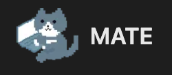

> **프리랜서와 클라이언트를 위한 가장 쉬운 매칭 플랫폼**

<table>
<tr>
<td><strong>카카오톡으로 3초만에 시작!</strong></td>
<td>복잡한 회원가입은 이제 그만! 카카오톡 계정만 있으면 바로 시작할 수 있어요. 간단하고 빠르게, 정말 필요한 것만 모았습니다.</td>
</tr>
<tr>
<td><strong>수수료는 0원!</strong></td>
<td>중간에 떼어가는 수수료는 전혀 없어요. 프리랜서님이 정한 금액 그대로 받으시고, 클라이언트분도 그 금액만 지불하시면 됩니다.</td>
</tr>
<tr>
<td><strong>태그로 쉽게 찾기</strong></td>
<td>React, UI/UX, 모바일 앱... 원하는 기술 태그만 검색하면 딱 맞는 프리랜서를 바로 찾을 수 있어요. 더 이상 헤매지 마세요!</td>
</tr>
<tr>
<td><strong>채팅으로 바로 연결</strong></td>
<td>마음에 드는 프리랜서를 발견했다면? 클릭 한 번으로 채팅방이 열려요. 연락처 교환할 필요 없이 바로 대화를 시작하세요.</td>
</tr>
<tr>
<td><strong>나만의 프로필 만들기</strong></td>
<td>포트폴리오 링크, 개인 블로그, 이메일... 자신을 표현할 수 있는 모든 걸 자유롭게 설정해보세요.</td>
</tr>
</table>
</div>

<br>
<br>

# 👨‍💻 개발자 소개

<div align="center">
<table>
<tr>
<td rowspan="2" width="150" align="center">

</td>
<td width="100" align="center"><strong>이름</strong></td>
<td width="200"><strong>이윤재</strong></td>
</tr>
<tr>
<td align="center"><strong>역할</strong></td>
<td><strong>프론트엔드 1인 개발</strong></td>
</tr>
</table>
</div>
<br>
<br>

# 🛠️ 기술 스택

<table>
<tr>
<td><strong> Frontend</strong></td>
<td>


</td>
</tr>
<tr>
<td><strong> State Management</strong></td>
<td>


</td>
</tr>
<tr>
<td><strong> Styling & UI</strong></td>
<td>


</td>
</tr>
<tr>
<td><strong> Tools & Libraries</strong></td>
<td>


</td>
</tr>
</table>

<div align="center">

</div>
<br>
<br>

# ✨ 주요 기능 및 화면 구성

<div align="center">

| <div style="background: linear-gradient(135deg, #667eea 0%, #764ba2 100%); color: white; padding: 8px; border-radius: 6px; font-weight: bold;">홈페이지 - 메인화면 (데스크톱)</div> | <div style="background: linear-gradient(135deg, #667eea 0%, #764ba2 100%); color: white; padding: 8px; border-radius: 6px; font-weight: bold;">홈페이지 - 메인화면 (모바일)</div> |
| :---------------------------------------------------------------------------------------------------------------------------------------------------------------------------------: | :-------------------------------------------------------------------------------------------------------------------------------------------------------------------------------: |
|                                               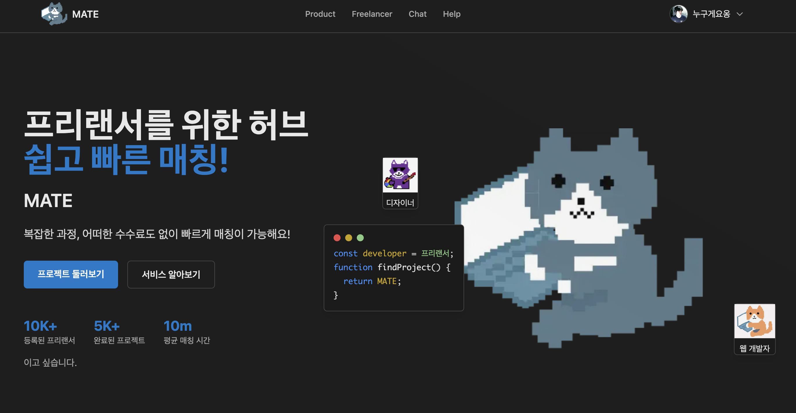                                               |                                               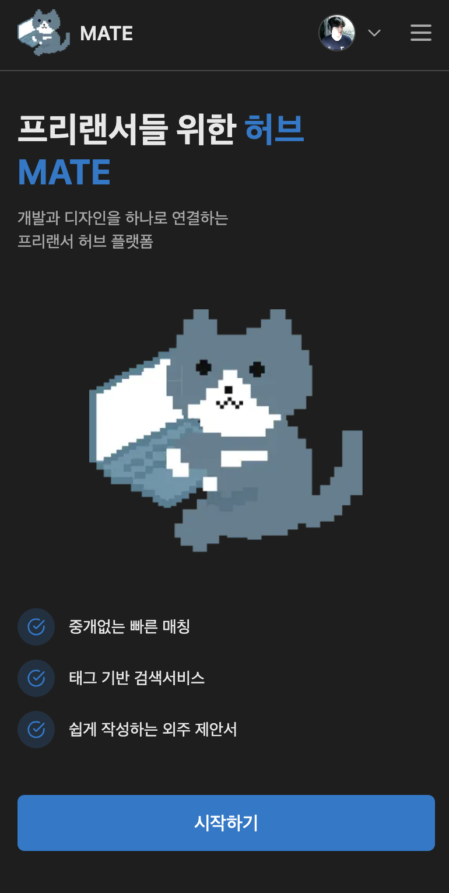                                                |

| <div style="background: linear-gradient(135deg, #f093fb 0%, #f5576c 100%); color: white; padding: 8px; border-radius: 6px; font-weight: bold;">프로젝트 리스트 (데스크톱)</div> | <div style="background: linear-gradient(135deg, #f093fb 0%, #f5576c 100%); color: white; padding: 8px; border-radius: 6px; font-weight: bold;">프로젝트 리스트 (모바일)</div> |
| :-----------------------------------------------------------------------------------------------------------------------------------------------------------------------------: | :---------------------------------------------------------------------------------------------------------------------------------------------------------------------------: |
|                                           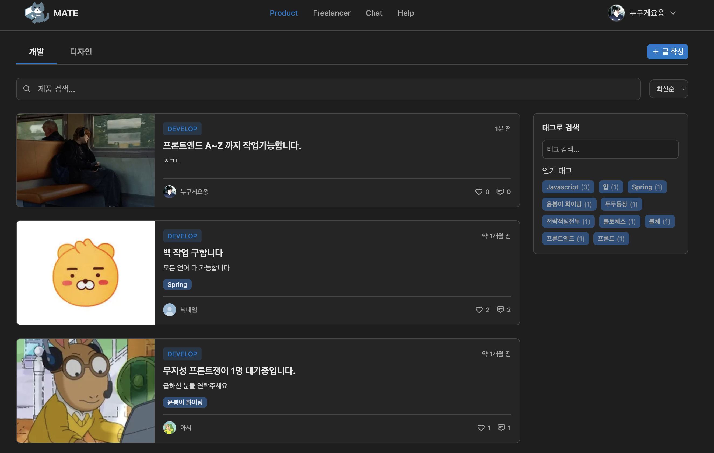                                           |                                           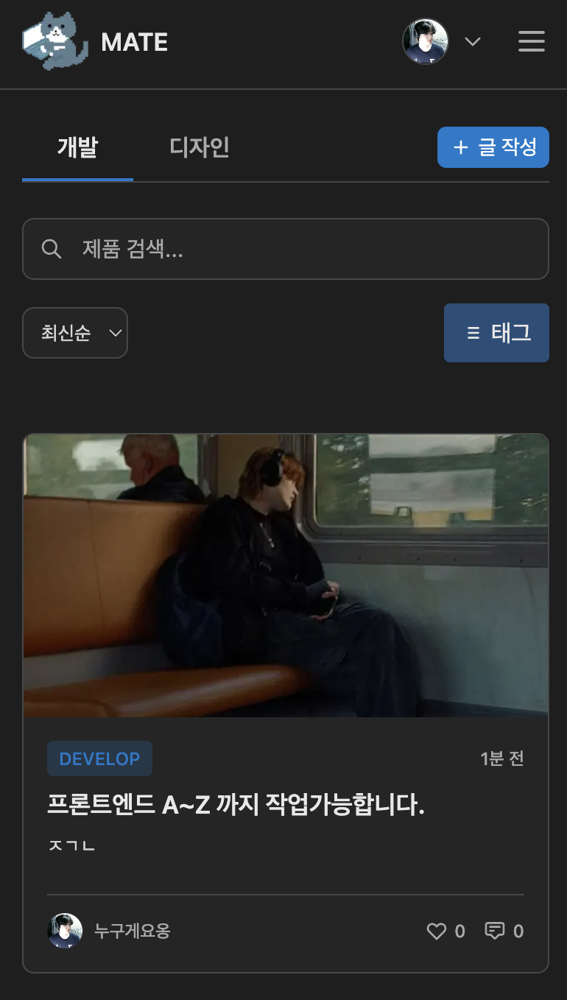                                            |

| <div style="background: linear-gradient(135deg, #4facfe 0%, #00f2fe 100%); color: white; padding: 8px; border-radius: 6px; font-weight: bold;">프로젝트 상세 (데스크톱)</div> | <div style="background: linear-gradient(135deg, #4facfe 0%, #00f2fe 100%); color: white; padding: 8px; border-radius: 6px; font-weight: bold;">프로젝트 상세 (모바일)</div> |
| :---------------------------------------------------------------------------------------------------------------------------------------------------------------------------: | :-------------------------------------------------------------------------------------------------------------------------------------------------------------------------: |
|                                          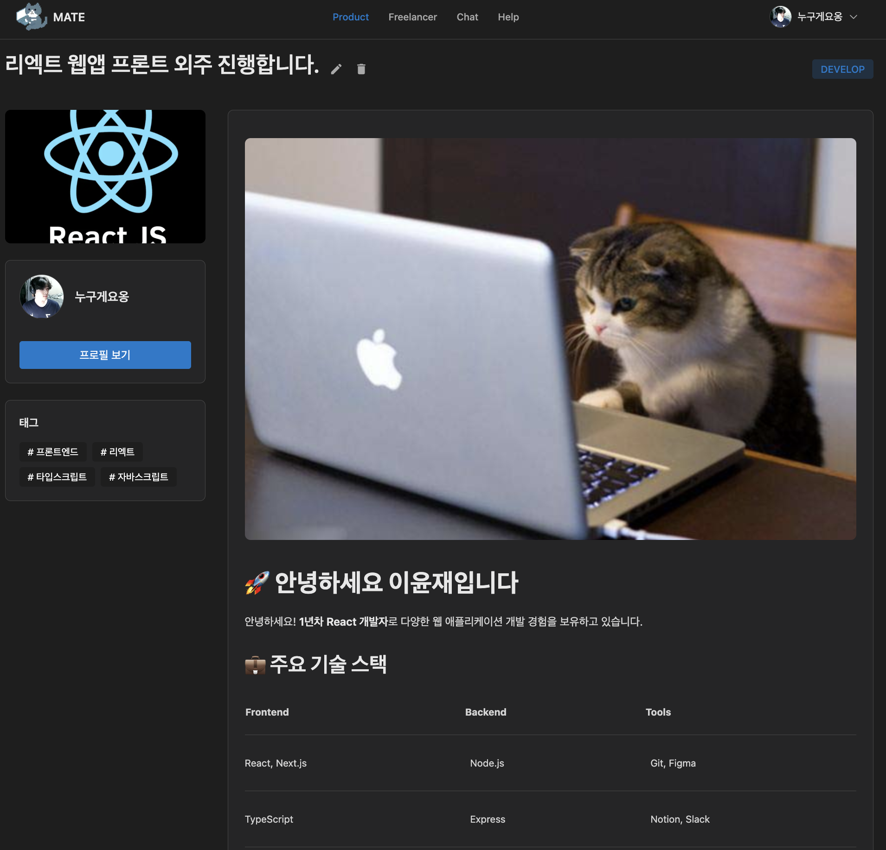                                          |                                          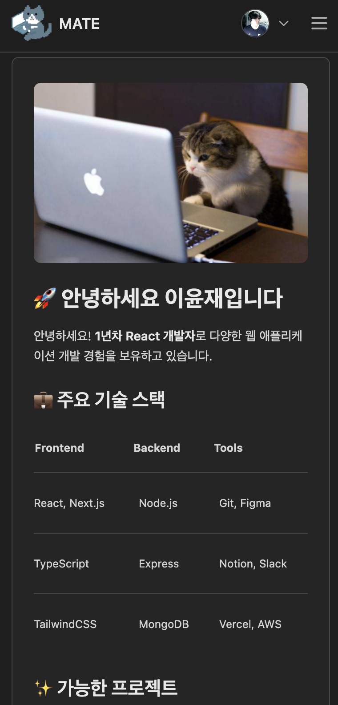                                           |

| <div style="background: linear-gradient(135deg, #fa709a 0%, #fee140 100%); color: white; padding: 8px; border-radius: 6px; font-weight: bold;">사용자 프로필 (데스크톱)</div> | <div style="background: linear-gradient(135deg, #fa709a 0%, #fee140 100%); color: white; padding: 8px; border-radius: 6px; font-weight: bold;">사용자 프로필 (모바일)</div> |
| :---------------------------------------------------------------------------------------------------------------------------------------------------------------------------: | :-------------------------------------------------------------------------------------------------------------------------------------------------------------------------: |
|                                          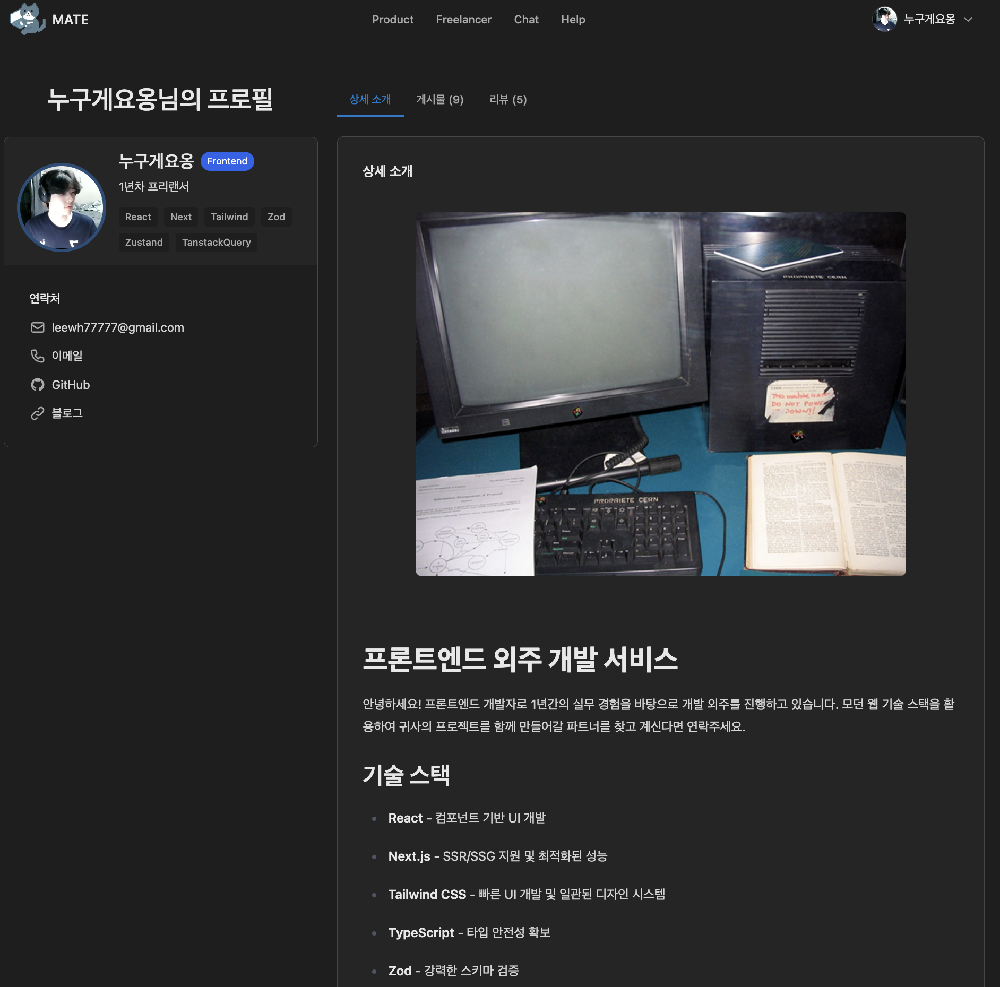                                          |                                          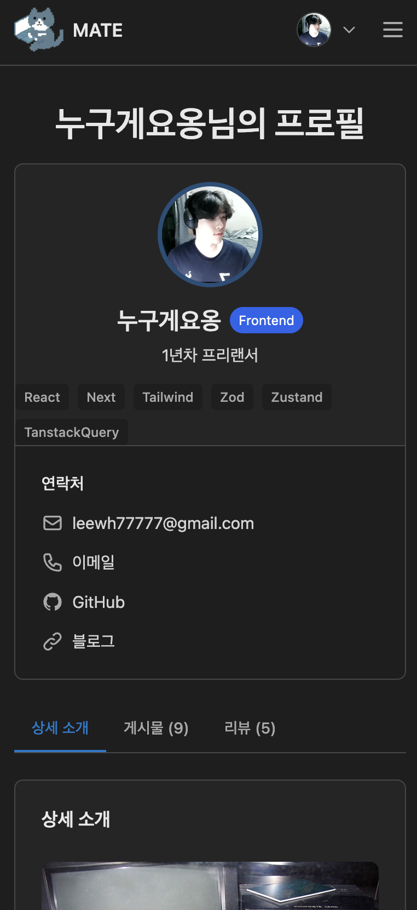                                           |

| <div style="background: linear-gradient(135deg, #a8edea 0%, #fed6e3 100%); color: #333; padding: 8px; border-radius: 6px; font-weight: bold;">마이페이지</div> | <div style="background: linear-gradient(135deg, #a8edea 0%, #fed6e3 100%); color: #333; padding: 8px; border-radius: 6px; font-weight: bold;">마이페이지 수정</div> |
| :------------------------------------------------------------------------------------------------------------------------------------------------------------: | :-----------------------------------------------------------------------------------------------------------------------------------------------------------------: |
|                                                                             |                                    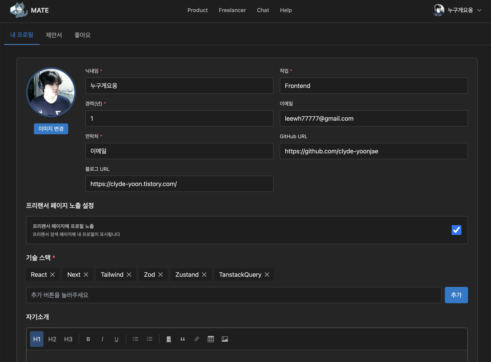                                     |

| <div style="background: linear-gradient(135deg, #ffecd2 0%, #fcb69f 100%); color: #333; padding: 8px; border-radius: 6px; font-weight: bold;">프로젝트 등록</div> | <div style="background: linear-gradient(135deg, #ffecd2 0%, #fcb69f 100%); color: #333; padding: 8px; border-radius: 6px; font-weight: bold;">채팅리스트</div> |
| :---------------------------------------------------------------------------------------------------------------------------------------------------------------: | :------------------------------------------------------------------------------------------------------------------------------------------------------------: |
|                                    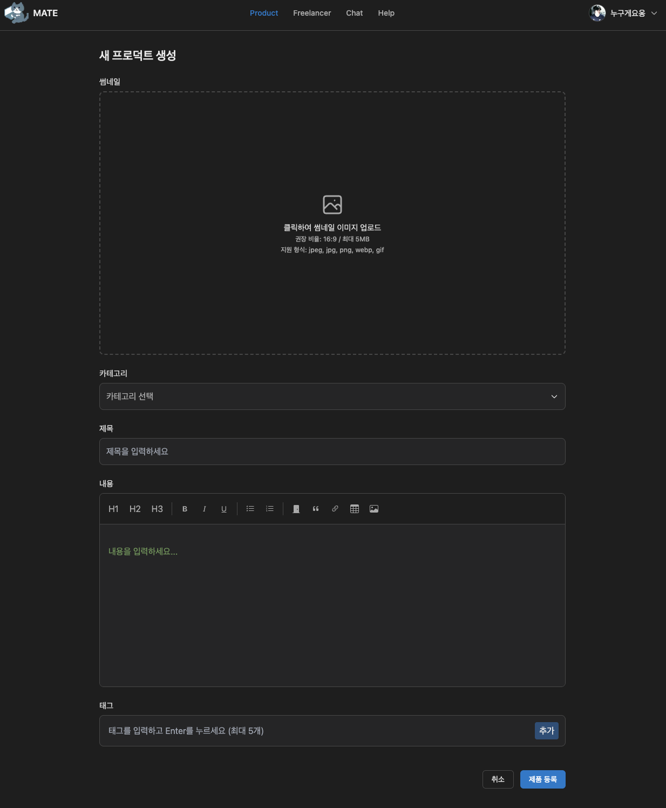                                    |                              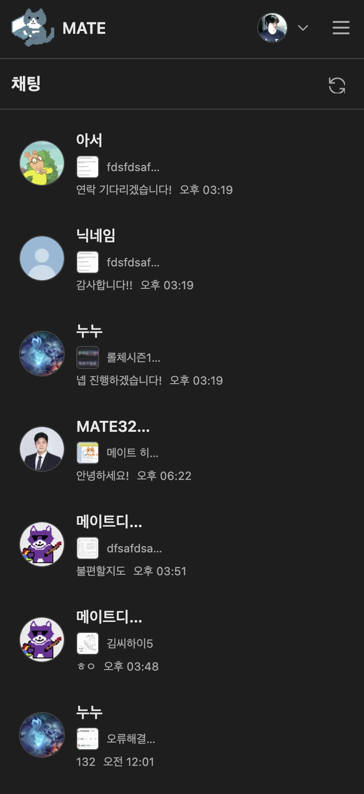                               |

| <div style="background: linear-gradient(135deg, #d299c2 0%, #fef9d7 100%); color: #333; padding: 8px; border-radius: 6px; font-weight: bold;">채팅룸</div> | <div style="background: linear-gradient(135deg, #d299c2 0%, #fef9d7 100%); color: #333; padding: 8px; border-radius: 6px; font-weight: bold;">도움말 페이지</div> |
| :--------------------------------------------------------------------------------------------------------------------------------------------------------: | :---------------------------------------------------------------------------------------------------------------------------------------------------------------: |
|                               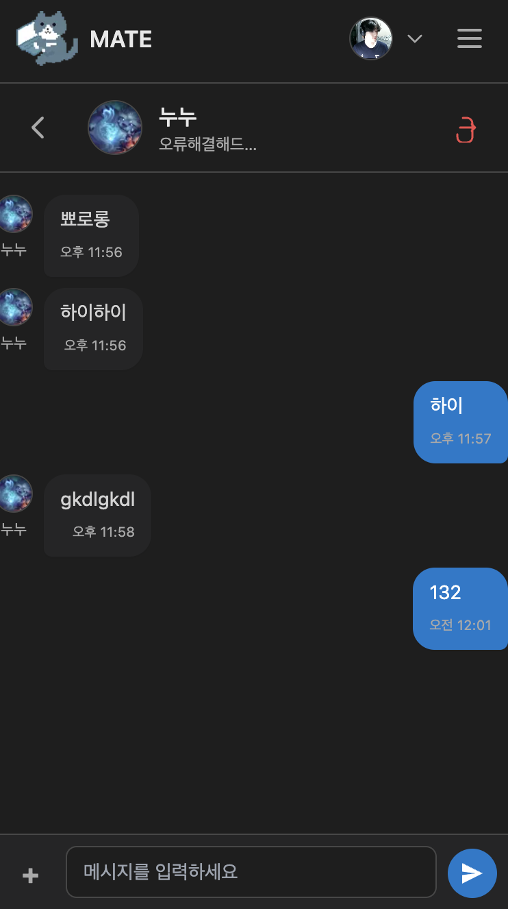                               |                                         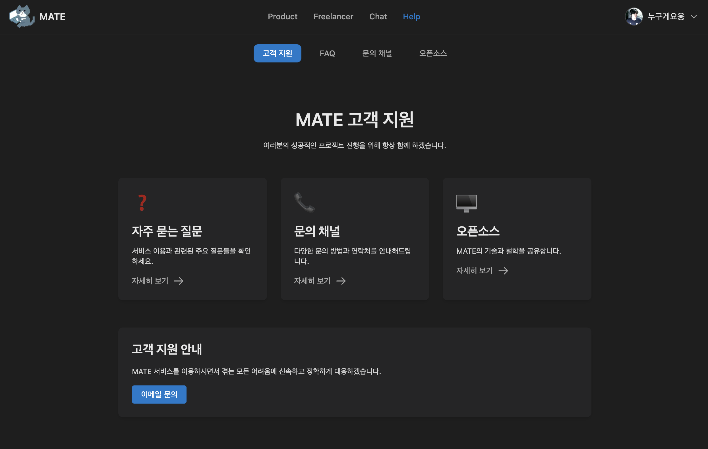                                         |

</div>

# 📁 폴더 아키텍처

### Next.js App Router 기반 컴포넌트 아키텍처

Next.js App Router의 특성을 최대한 활용하여 **서버 컴포넌트**, **클라이언트 컴포넌트**, **페이지 전용 컴포넌트**로 계층을 분리한 **관심사 분리** 아키텍처를 구현했습니다.

#### 서버 컴포넌트 (Server Components)

- **React Query의 Prefetch 활용**: 서버에서 데이터를 미리 페칭하여 **초기 로딩 성능 최적화** 및 **하이드레이션 미스매치 방지**
- **SEO 최적화**: 각 페이지별 메타데이터 및 Open Graph 태그를 서버에서 동적 생성
- **Zero Bundle Impact**: 서버에서만 실행되어 클라이언트 번들 크기에 영향을 주지 않음

#### 페이지 전용 컴포넌트 (Page-specific Components)

- **단일 책임 원칙(SRP)** 적용: 각 컴포넌트가 하나의 명확한 역할과 책임을 가지도록 설계
- **Props Drilling 최소화**: 컴포넌트 간 의존성을 줄이고 데이터 흐름을 명확히 하여 유지보수성 향상
- **응집도 최대화**: 관련된 로직과 UI를 하나의 컴포넌트에 집중시켜 코드의 가독성과 재사용성 증대

#### 클라이언트 컴포넌트 (Client Components)

- **상호작용 중심**: 사용자 이벤트 처리 및 상태 관리가 필요한 컴포넌트만 선별적으로 클라이언트 사이드에서 실행

### 아키텍처의 이점

- **성능 최적화**: 서버 컴포넌트와 Prefetch를 통한 빠른 초기 렌더링
- **SEO 친화적**: 서버에서 완전한 HTML 생성으로 검색 엔진 최적화
- **유지보수성**: 명확한 책임 분리로 코드 수정 시 사이드 이펙트 최소화
- **확장성**: 컴포넌트별 독립적 개발 및 테스트 가능

**예시**

```md
app/user/[id]/
├── page.tsx # 🖥️ 서버 컴포넌트 (데이터 페칭 및 SEO 관리)
├── page-components/ # 📄 페이지별 전용 컴포넌트
│ ├── UserDetailedIntro.tsx  
│ ├── UserPostsList.tsx  
│ ├── UserProfileCard.tsx  
│ ├── UserProfileContainer.tsx
│ ├── UserProfileTabs.tsx  
│ └── UserReviewsList.tsx  
└── layout.tsx # 레이아웃
```

<br>
<br>

# API 아키텍처

<br>

React Query와 TypeScript를 활용한 타입 안전한 API 통신 시스템을 구축했습니다. 클라이언트와 서버 환경 모두를 지원하며, 자동 토큰 재발급과 에러 핸들링 기능을 제공합니다.
<br>

### 계층별 구조

```
API Layer
├── URL 관리 (apiVersion, endpoints)
├── 클라이언트 API (apiClient)
├── 서버 API (apiServerGet, apiServerPost)
├── React Query Hooks (mutations, queries)
└── 컴포넌트 (에러 핸들링)
```

## 주요 구성 요소

### 1. API 버전 및 엔드포인트 관리

**API 버전 관리** - [📁 apiVersion.ts](./service/api-version/apiVersion.ts)

**엔드포인트 중앙 관리** - [📁 endpoints.ts](./service/endpoints/endpoints.ts)

- 도메인별로 URL 그룹화 (auth, user, product, chat 등)
- 동적 파라미터 지원 함수형 URL 생성
- 타입 안전한 URL 구성

### 2. API 레이어

커스텀 HTTP 클라이언트 아키텍처 - [📁 API.README.md](./utils/api/README.md)

**핵심 기능**

- **자동 토큰 재발급**: 401 에러 시 자동으로 액세스 토큰 갱신
- **큐잉 시스템**: 토큰 갱신 중 중복 요청 방지 및 대기열 처리
- **이중 인증 방식**: Authorization 헤더와 Cookie 방식 선택적 사용
- **Zod 스키마 검증**: 런타임 타입 안전성 보장

**에러 처리**

- 401 에러 시 자동 토큰 재발급 및 요청 재시도
- 토큰 갱신 실패 시 로그인 페이지 리디렉션
- 네트워크 에러와 서버 에러 구분 처리

### 3. React Query 통합

**Mutation Hooks**

- `useCreateChatRoom`, `useCreateProduct`, `useDeleteProduct` 등
- 낙관적 업데이트 및 캐시 무효화
- 성공/실패 콜백 처리

**Query Hooks**

- `useChatMessages`, `useProductDetail`, `useFreeLancerSearch` 등
- 자동 캐싱 및 백그라운드 업데이트
- 로딩 상태 및 에러 상태 관리

## 기술적 특징

### 1. 타입 안전성

- TypeScript와 Zod를 통한 컴파일 타임 + 런타임 검증
- API 응답 스키마 자동 검증
- 제네릭을 활용한 재사용 가능한 API 클라이언트

### 2. 환경별 최적화

- **클라이언트**: 쿠키 기반 토큰 저장 및 자동 갱신
- **서버**: Next.js cookies()를 통한 서버사이드 인증

### 3. 에러 핸들링 전략

- **컴포넌트 레벨**: 각 컴포넌트에서 개별적인 에러 처리
- **전역 에러**: 인증 만료 시 자동 로그인 페이지 이동
- **사용자 친화적**: 명확한 에러 메시지 제공

<br>
<br>

## 📝 개발 기록

프로젝트를 진행하면서 마주한 기술적 문제들에 대한 의사결정 과정과 해결 과정을 기록했습니다.

<table>
<tr>
<td width="200"><strong>페이지네이션 스크롤 복원</strong></td>
<td><a href="https://clyde-yoon.tistory.com/31">https://clyde-yoon.tistory.com/31</a></td>
</tr>
<tr>
<td><strong>채팅 구현 기록</strong></td>
<td><a href="https://clyde-yoon.tistory.com/33">https://clyde-yoon.tistory.com/33</a></td>
</tr>
</table>

<br>
<br>

## 🌐 CI/CD

<div align="start">

**Vercel 자동 배포**로 운영 중입니다.

`main` 브랜치에 푸시하면 자동으로 배포되어 실시간으로 업데이트됩니다. MATE Front는 1인 개발로 별도의 CI/CD 파이프라인 없이 Vercel의 Git 연동 기능을 활용해 심플하게 관리하고 있습니다.

**배포 링크:** [https://mate.springbud.site/](https://mate.springbud.site/)

### 배포 환경

- **플랫폼**: Vercel
- **자동 배포**: GitHub `main` 브랜치 연동
- **환경 변수**: Vercel Dashboard에서 관리

<br>

---

<br>

<div align="center">

**⭐ 읽어주셔서 정말 감사합니다! ⭐**

</div>
